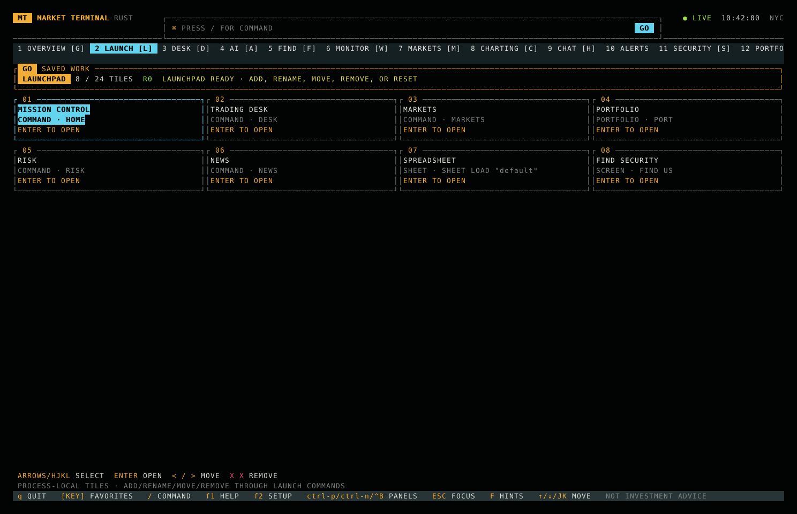
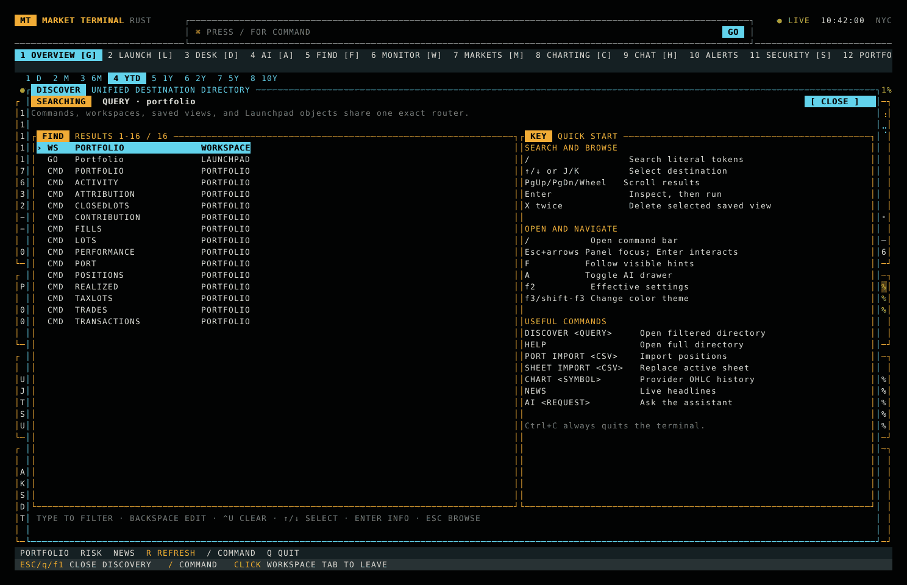
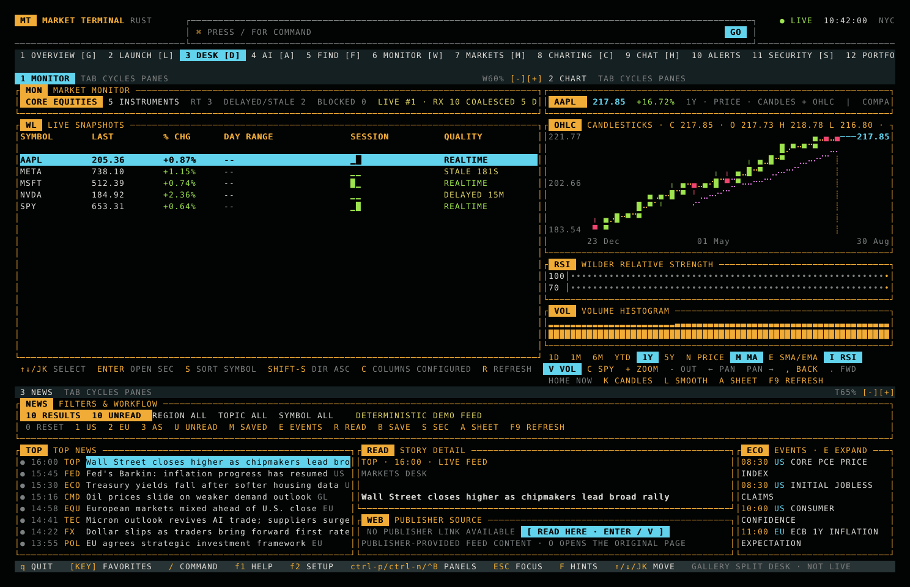
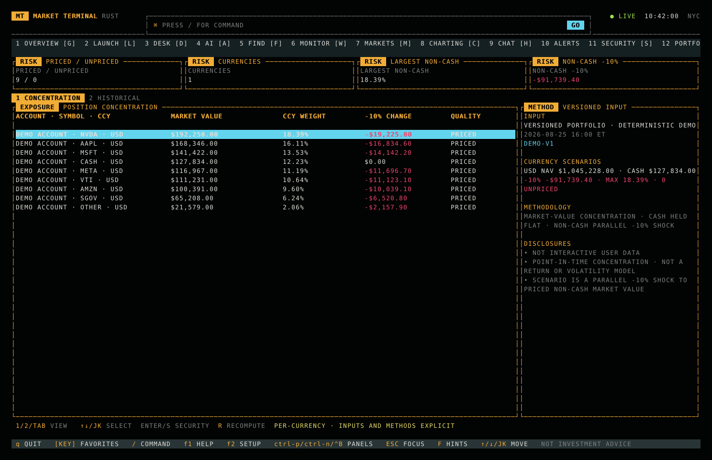
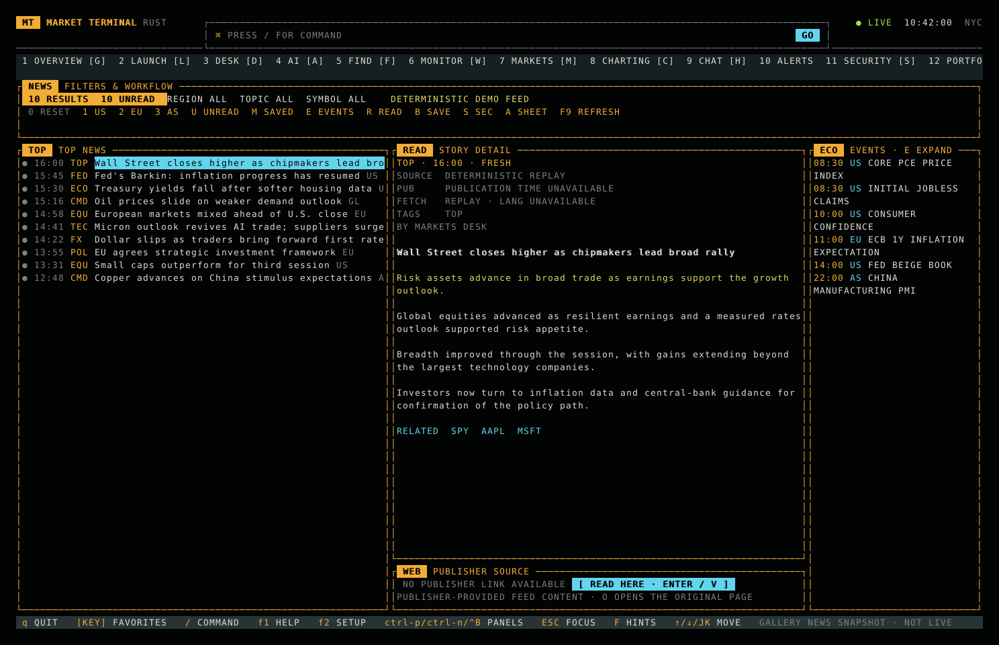
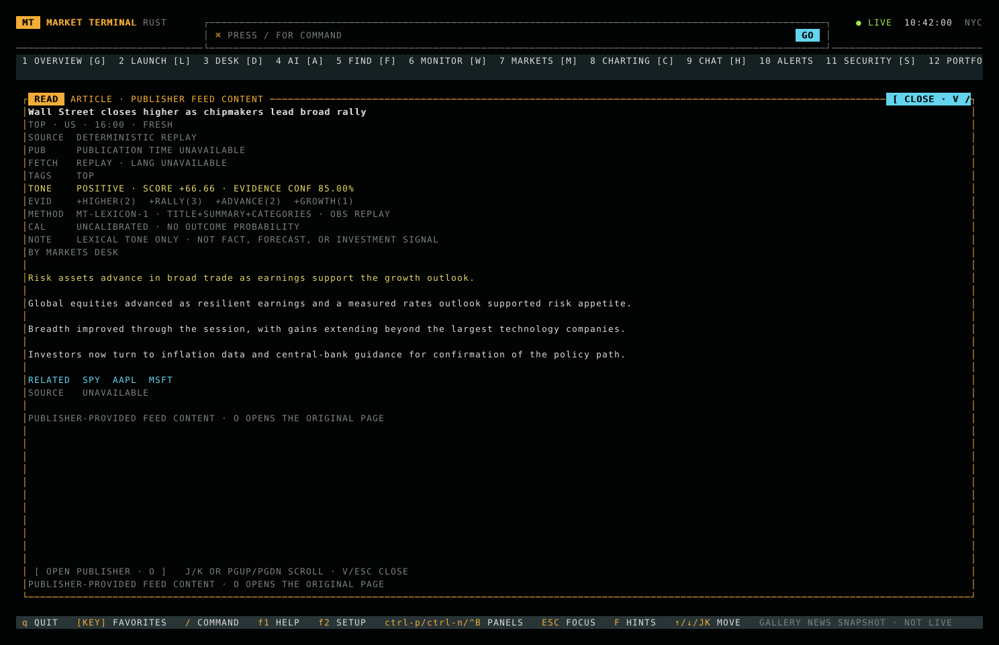

# Market Terminal

_I pasted this tweet into ChatGPT and just told it to keep going in between boogieboarding_


A native Rust, open-source market workstation inspired by the information
density and keyboard ergonomics of professional financial terminals.

The application runs directly in your terminal. Ratatui draws every panel,
table, chart, border, and color; Crossterm handles input and terminal state.
There is no HTML, CSS, JavaScript, WebAssembly, or browser runtime.

## Workspaces

- Mission Control — ranked actionable items, live market pulse, imported
  portfolio state, provider-backed events, source health, saved work, and
  current news with explicit offline and missing-data states
- Desk — recoverable, bounded Monitor/Chart and market/News split geometry,
  with keyboard, pointer, spatial-focus, and follow-hint routing
- Markets — external listed-instrument snapshots, with unsupported cross-asset
  and analytics datasets called out instead of mocked
- Security — quote/chart, financials, raw SEC Form 4 insider transactions,
  filings, explicitly unavailable estimates/peers, and linked news
- Portfolio — imported positions, cash activity, and dated flow-adjusted returns
- News — asynchronously refreshed RSS/Atom stories, filters, unread/bookmarks,
  an on-demand in-terminal article reader, clickable publisher links, and
  linked securities
- Spreadsheet — durable multi-sheet workbooks, workbook-scoped recalculation,
  cross-sheet and mixed absolute references, 27 pure functions, translated
  copy/fill, undo/redo, CSV, and composable `PX_LAST`, `PX_CHANGE`, `HISTORY`,
  and `FUNDAMENTAL` cells with explicit data-quality state
- AI — ChatGPT-authenticated Codex analysis and natural-language workspace control,
  with an optional OpenRouter fallback
- Find — canonical instrument identity and ranked symbol/company discovery
- Monitor — configurable watchlists, bounded quote streams, sorting,
  provider day ranges, bounded session sparklines, responsive columns,
  data-quality states, last-known-good fallback, plus spatial/follow routing for
  visible rows and discrete sort, direction, column, and refresh controls
- Chart — comparative performance, zero baselines, inspection cursor, market
  profile statistics, half-block OHLC candlesticks, volume histograms, SMA/EMA
  overlays, and Wilder RSI
- Screening — versioned point-in-time universes, typed multi-clause filters,
  deterministic ranking, explicit null/coverage handling, saved definitions,
  and explainable row evidence
- Backtest — reproducible, next-bar moving-average research replay with explicit
  execution costs, integer-share accounting, immutable hashes, equity/drawdown,
  and a signal-to-fill audit; it has no live order path
- Fixed Income — transparent fixed-rate bullet cash flows, clean/dirty price,
  accrued interest, yield risk, and deterministic curve-shock reference analytics
- Chat — TLS-capable IRC market rooms with bounded queues, background reconnect,
  participant presence, notices, actions, and an inline composer
- Alerts — idempotent, debounced local rules with acknowledgement and audit state

Use the labeled navigation keys, click a visible workspace tab, or type a
function such as `MON`, `CHART`, `SCREEN`, `BACKTEST`, `SHEET`, `CHAT`, `FIND`, or `ASK` into the
command bar. Exact functions always take precedence; otherwise the configured
AI command plane infers one command through a bounded, background request.
Cashtags such as `$META`, company names, and requests such as `show me Meta`
can therefore resolve to `SEC META`; ambiguous requests resolve to `FIND`.
Model output cannot dispatch until its function passes the same exact command
registry as typed commands. Mouse input is enabled in the interactive terminal:
click the command box and `GO`, select table rows and spreadsheet cells,
activate chart controls and research tabs, focus AI/chat composers, and scroll
navigable lists. News uses live source feeds, Portfolio uses your imported
snapshot, and Overview composes those same real snapshots without performing
I/O while rendering. Persistent workspaces do not substitute deterministic
gallery analytics when an external source is missing; the separate gallery
host remains available for screenshots and tests.

From any workspace, press `Esc` to lift focus to the feature's preferred visible
action. Bare arrows move spatially among registered rows, tabs, controls, and
panes without being consumed by the panel underneath; movement is lane-first,
deterministic, and does not wrap at an edge. `Enter` activates the highlighted
action and returns interaction to the destination. Workspaces without registered
actions retain arrow-based workspace-rail navigation. Press `F` to enter
follow-hint mode: every visible workspace plus the command bar, Help, Setup,
and Quit receives a prefix-free one- or two-letter label. Type a label to route
there immediately, or press `Esc` to cancel. The labels use the familiar
Vimium-style link-hint interaction while remaining terminal-native.

Portfolio, Monitor, Desk, Security, Chart, News, Overview, Alerts, and Spreadsheet
extend follow hints and spatial focus inside the active panel. Their currently
rendered tabs, rows, panes, cells, and controls
receive labels and focus at their actual terminal coordinates; the natural
selected or primary action becomes the restoration target. Off-screen, disabled,
duplicate, and stale actions are not routable. Each feature owns activation and
the shell remains unaware of portfolio, quote, or research domain behavior.

News exposes its responsive filter strip, selected-story operations, visible
headline rows, detail links, calendar events, and refresh control through the same
geometry used for rendering and mouse input. Story actions carry a stable content
identity and fail closed if a refresh replaces the selected item. While the article
reader is open, keyboard and pointer input are trapped inside it and `F` labels only
its close and available publisher-page actions; closing restores the ordinary shell
escape hierarchy.

Chart exposes direct `1D`, `1M`, `6M`, `YTD`, `1Y`, and `5Y` destinations plus
normalization, moving-average kind and visibility, RSI, volume, SPY comparison,
inspection, latest observation, display and line modes, Spreadsheet promotion,
and refresh. The three-row control strip is packed responsively without partial
controls; its render rectangles are also its mouse targets, arrow-focus targets,
and `F`-hint anchors. The selected period restores focus, unavailable inspection
directions are excluded, and every activation rechecks current chart state.

`SCREEN` opens a point-in-time ranked universe. Built-in `momentum`,
`liquidity`, and `tight-spread` definitions are immutable; custom definitions
are versioned and persisted privately:

```text
SCREEN momentum
SCREEN SAVE liquid-gainers core change_pct >= 1 AND volume >= 1000000 SORT change_pct DESC LIMIT 25
SCREEN SAVE quality-move core (change_pct >= 1% OR volume >= 20m) AND NOT spread_bps > 5bps SORT change_pct DESC LIMIT 25
SCREEN LIST
SCREEN DELETE liquid-gainers
SCREEN HISTORY core
SCREEN HISTORY AUDIT
SCREEN HISTORY REPAIR
SCREEN REPLAY V0123456789ABCDEF momentum
SCREEN LIVE
```

Predicates are typed over last price, percent change, volume, bid/ask spread,
and day-range percent. Saved definitions support bounded nested `AND`, `OR`,
`NOT`, and parentheses with normal boolean precedence. Percent (`%`/`pct`),
basis-point (`bp`/`bps`), and volume (`k`/`m`/`b`) suffixes are normalized only
when compatible with the field dimension. Missing values remain unknown through
the tree—especially under `NOT`—and fail closed at the result boundary. Ties
resolve by canonical instrument identity, and the header reports input version,
as-of, source, coverage, matches, and exclusions. The detail pane shows actual
values and pass/fail evidence for every predicate. Use arrows or `j`/`k` to select rows,
`Enter`/`s` for Security, `c` for Chart, `a` for Spreadsheet insertion, `m` for the source
Monitor universe, `h` for retained input versions, `l` to return to live mode,
`[`/`]` to cycle definitions, and `r` to rerun the current live or replay input.
Persistent deployments retain 32 immutable universe frames by default,
configurable from 1 to 256 with
`MARKET_TERMINAL_SCREEN_HISTORY_RETENTION`, with independent content
verification; exact replay never calls the provider or substitutes a
newer frame. `SCREEN HISTORY AUDIT` verifies every manifest reference and reports
missing, corrupt, orphaned, malformed, and over-policy state. Explicit `SCREEN
HISTORY REPAIR` first publishes a manifest containing only verified, in-policy
frames and only then removes stale documents; it is serialized against live
publication and safe to repeat after interruption. Mouse,
spatial focus, and `F` hints use those same identity-checked actions. See
[the Screening contract](docs/screening.md) for limits, persistence, and the
remaining P2/P3 scope.

`BACKTEST` opens the first P6 research-replay slice. It consumes the same
provider-neutral historical-price adapter through a Backtesting-owned port, but
copies each input into an immutable integer-price contract before evaluation:

```text
BACKTEST AAPL
BACKTEST MSFT FAST 10 SLOW 50 COST 5 COMMISSION 1.00
```

The reference strategy is deliberately narrow: long-only SMA crossover signals
are observed at a bar close and can execute only at the next bar's open. Buys
and sells apply the configured all-in basis-point penalty and fixed commission;
cash, integer shares, turnover, marked equity, and drawdown reconcile from those
fills. Every result displays independent configuration, data, and run digests,
the source/quality/input version, and the full signal-to-execution timestamps.
Runs execute on a capacity-one worker, reject stale completions, retain the last
valid result on failure, and round-trip their configuration through saved views.
Use `BACKTEST SAVE`, `LIST`, `OPEN <RUN-DIGEST>`, and `DELETE <RUN-DIGEST>` for
the bounded immutable run catalog. `BACKTEST EXPORT <PATH>` writes the exact
verified artifact as private deterministic JSON and refuses overwrite;
`EXPORT!` explicitly requests atomic replacement. A complete artifact digest
detects mutations across configuration, metrics, decisions, fills, equity,
methodology, and disclosures before a saved run is opened. `BACKTEST COMPARE
<BASELINE-RUN> <CANDIDATE-RUN>` adds a third terminal view with paired return,
drawdown, turnover, trade-count, and final-equity deltas. It fails closed unless
both immutable artifacts share the exact instrument, provider labels, input
version, data digest, dates, bar count, and initial cash, and it publishes its own
complete evidence digest. The display is explicitly descriptive and in-sample;
it makes no significance or robustness claim.
This is research replay—not paper or live trading—and does not model corporate
actions, calendars, borrow, leverage, partial fills, impact, dividends, or taxes.
See [the Backtesting contract](docs/backtesting.md).

`OPTIONS`/`OPT` opens the first P5 derivatives slice: a transparent European
Black-Scholes reference model over explicit user inputs. For example,
`OPTIONS AAPL CALL 190 200 30 25 5 0 100` prices a 30-calendar-day call with
25% annual volatility, 5% continuous rate, no dividend yield, and a 100-share
multiplier. The workspace separates price, intrinsic/time value, analytic Greeks,
and a deterministic 5×3 spot/volatility scenario grid; model version, ACT/365
convention, units, multiplier, disclosures, and an input digest remain visible.
It intentionally loads no chain, quote, provider IV, OI, volume, or provider
Greeks and cannot submit an order. See [the Options contract](docs/options.md).

`BOND`/`FI` opens the first P5 fixed-income slice. For example,
`BOND UST-5Y-REFERENCE USD 100 4.5 4.25 5 SEMI 0` builds an exact semiannual
fixed-rate bullet schedule from explicit inputs. The workspace reconciles clean
price, dirty price, accrued interest, coupon cash flows, current yield, Macaulay
and modified duration, convexity, DV01, and seven parallel yield shocks. Model
version, units, compounding, accrual convention, exclusions, and an input digest
remain visible. It deliberately loads no live curve, calendar, market price,
spread, or credit state. See [the Fixed-income contract](docs/fixed-income.md).

`DESK` (aliases `SPLIT` and `DASHBOARD`) opens the combined workspace adapted
from `alphai-tui`. Press `Tab`/`Shift+Tab` or `1`/`2`/`3` to focus Monitor,
Chart, or News. Clicking inside a pane focuses it and sends subsequent keys to
that pane. The three visible pane headers also participate in `Esc` spatial
focus and `F` follow hints; child actions are namespaced through Desk while
retaining their real body coordinates. Monitor rows and controls therefore remain
directly routable inside the split Desk. On short terminals the News pane yields
instead of crushing the market panels and is removed from routing; use `NEWS`
for the full feed.

Use `Alt+Left`/`Alt+Right` to give Chart/Monitor five percentage points more
width and `Alt+Up`/`Alt+Down` to give News/the market row five percentage points
more height. The visible `W…% [-][+]` and `T…% [-][+]` header controls expose
the same operations to the mouse and `F` hints. Pane headers deliberately
remain the direct bare-arrow route; their
nested resize buttons remain available through `F`. Geometry is deliberately
bounded: Monitor occupies 30–70% of the width,
and the upper market row occupies 40–75% of the height. Commands provide exact,
atomic changes and a stable reset:

```text
DESK COLUMNS 60
DESK ROWS 65
DESK LAYOUT 60 65
DESK RESET
```

Rendering, hit testing, pane-body routing, spatial actions, and follow labels all
derive from the same current geometry. At a bound, the unavailable direction is
removed from action routing. On short terminals the News pane still yields and
its row controls are removed.

Run `DISCOVER [QUERY]` to search one deterministic directory of commands,
workspaces, saved views, and typed Launchpad objects. `HELP` or `F1` opens the
same inventory in browse mode without leaving the current workspace. Matching
is case-insensitive and literal, every query token is required, and exact
canonical commands rank before aliases and descriptive keywords. Press `/` to
search, use arrows or `J`/`K` to select, then press `Enter` once to inspect and
again to run the stored exact command. `X` twice deletes only the selected
saved-view ID and revision; a changed view cannot inherit an older confirmation.
`Esc` returns one level at a time from details or search and then closes the
overlay. See [the unified discovery contract](docs/discovery.md) for bounds,
ranking, contribution, and mutation-safety rules.

Run `SETTINGS` (aliases `CONFIG` and `SETUP`) or press `F2` to inspect the
secret-free effective startup configuration. On the first persistent launch,
this setup screen opens automatically once. It shows credential presence but
never credential values, and identifies which `.env` changes require a restart.

Run `PRESET TRADER`, `PRESET QUANT`, `PRESET PM`, `PRESET RISK`, or
`PRESET OPS` to preview a versioned role-oriented workspace order. The modal
shows the current and proposed order before anything changes; confirm with
`Enter`/`Y` or cancel with `Esc`/`N`. The first applied role preserves the
current active workspace and complete custom order in crash-safe session state.
`PRESET RETURN` previews and restores that return point, including after a
restart. Unknown or retired workspace IDs are disclosed and skipped while new
workspaces retain their relative order.

Save an exact working view without leaving the keyboard:

```text
VIEW SAVE Morning Research
VIEW LIST
VIEW RESTORE Morning Research
VIEW DELETE Morning Research
```

Saved views have stable numeric IDs, case-insensitive names, monotonic
revisions, and independent crash-safe persistence. They restore workspace order
plus the active workspace; Desk views additionally retain the focused pane,
bounded column/row percentages, and nested Monitor, Chart, and News state.
Legacy Desk views recover the original 45/55 geometry; malformed geometry
degrades explicitly without discarding valid child state. Chart state includes
canonical instrument identity, period, normalization, comparisons, studies,
inspection cursor, zoom/pan window, and display modes. Security views retain
the provider-neutral instrument ID, terminal symbol, active research tab, and
stable selected Form 4 accession. The selection follows the accession when a
refresh reorders rows; a missing filing falls back visibly instead of opening a
different document. News views retain region, topic, symbol, unread, and saved
filters; the Stories/Events subview; and selected story identity. Selection
follows the story when a refreshed feed reorders rows; a missing story falls
back visibly. Reader modals, article text, URLs, read history, and bookmarks
remain outside layout storage. Monitor views retain the watchlist identity,
sort field and direction, exact configured column keys, active column preset,
selected canonical instrument, and top visible instrument. Selection stays on
the same instrument when live quotes reorder the table; long lists scroll to
keep it visible, and removed lists or instruments degrade explicitly. Quotes,
session sparklines, subscription metrics, and provider status remain live data,
not saved layout content. Portfolio views retain the active Positions,
Activity, Performance, Lots, Realized, Trades, Contribution, or Attribution
subview plus stable selected-row and top-visible-row identities. Row identities
use feature-owned account/instrument/currency composites or ledger, lot, and
execution IDs, so provider reordering does not silently change selection. The
bounded viewport is shared by rendering, mouse rows, arrows, spatial actions,
and follow hints. Holdings, broker records, calculated returns, methodology,
and provider status remain live Portfolio data, not layout content. Spreadsheet
views retain the durable workbook
identity, stable worksheet name with ordinal fallback, selected cell, and
row/column viewport. Workbook cells, clipboard contents, and undo history remain
in their owning document/session boundaries rather than being copied into a
layout. Alerts views retain stable selected-rule and top-visible-rule IDs. The
rule window is shared by rendering, mouse, arrows, spatial actions, and follow
hints, and a saved identity can wait safely for the asynchronous rule register
to arrive. Thresholds, observations, trigger/debounce state, delivery, and audit
history remain in Alerts' independently durable rule register rather than being
duplicated in layout storage. Restores report `EXACT` only when every applicable
field was accepted. Screening views retain only a saved definition ID plus
selected and top-visible canonical instrument identities. Universe members,
provider quotes, evaluation rows, and predicate evidence are recomputed from a
new versioned snapshot rather than copied into layout storage. A
retired workspace, missing workbook or story, renamed worksheet, malformed
instrument or filing identity, unsupported field, or future capability produces
an explicit `DEGRADED` result while the remaining valid layout is recovered.

Run `LAUNCH` (or press `L`) for the persistent Launchpad. Arrow keys or HJKL
select tiles, `Enter` opens the selected destination, `<`/`>` reorders it, and `X`
twice removes it. Tiles also participate in spatial focus, mouse routing, and
`F` follow hints. Tiles are typed as commands, canonical instruments, saved
screens, portfolios, workbooks, or saved layouts; the type and exact route are
visible before activation. Edit through the bounded command API:

```text
LAUNCH ADD "Apple Research" SEC AAPL US
LAUNCH ADD INSTRUMENT "Apple Security" equity:US:XNAS:AAPL "AAPL US" SEC
LAUNCH ADD SCREEN "US Finder" find-us FIND US
LAUNCH ADD PORTFOLIO "Tax Lots" default LOTS
LAUNCH ADD SHEET "Valuation Model" valuation-model
LAUNCH ADD LAYOUT "Opening Layout" "Morning Research"
LAUNCH RENAME 9 "Apple Deep Dive"
LAUNCH MOVE 9 1
LAUNCH REMOVE 9
LAUNCH EXPORT ~/launchpad.json
LAUNCH IMPORT ~/team-launchpad.json
LAUNCH RESET CONFIRM
```

The original command-tile syntax remains compatible; `LAUNCH ADD COMMAND` is
its explicit equivalent. `IMPORT` merges atomically and skips exact duplicates,
while `IMPORT!` performs an explicit replacement. `EXPORT` refuses to overwrite
an existing file; `EXPORT!` makes that destructive choice explicit. Portable
documents are bounded to 64 KiB, contain typed labels and targets but no local
tile IDs or revisions, and are written privately. Labels, target identities, and
generated commands are validated, local tile identities remain stable across
moves and matching replacements, and edits are coalesced onto a background
crash-safe writer. Schema-v1 command tiles migrate to typed command targets. A
failed or corrupt load is disclosed and falls back to the versioned seeds
instead of blocking the terminal. See [the Launchpad contract](docs/launchpad.md)
for the complete schema, merge, migration, and routing rules.

Tmux-style panel switching is also available. Press `Ctrl+B`, release it, then
use `Left`/`Right` or `N`/`P` for the next or previous workspace. Use `1`–`9`
and `0` to select the corresponding numbered workspace, or `?` for help.

The command bar starts in `INSERT` mode, so ordinary typing, arrows,
Home/End, Backspace/Delete, Enter, `Ctrl+W`, `Ctrl+U`, and Up/Down command
history work directly. Press `Esc` with a non-empty command to enter optional
Vi `NORMAL` mode: use `h`/`l`, `0`/`$`, `w`/`b`, `x`, `D`, `dd`, and
`i`/`a`/`I`/`A`. Press `Esc` again to cancel the command.

The interactive binary restores the active workspace, workspace order, preset
return point, saved views, Launchpad tiles, and recent commands from crash-safe,
versioned local state. Set
`MARKET_TERMINAL_STATE_DIR` to override the platform default. Corrupt current
state falls back to the previous valid generation and never blocks startup.

Press `F3`/`Shift+F3`, click the theme controls in Settings, or run `THEME`
and `THEME PREV` to cycle the color presets live. `THEME NORD` selects a
specific preset; the choices are `default`, Catppuccin Mocha/Macchiato/Frappé/
Latte, Dracula, Gruvbox Dark/Light, and Nord. The selection is persisted with
the shell session. `MARKET_TERMINAL_THEME=catppuccin-mocha` supplies the initial
theme before a saved interactive selection exists.

Shell and shared navigation keys can be remapped without changing feature
code. Set `MARKET_TERMINAL_KEYBINDINGS` to semicolon-separated actions whose
values are comma-separated keys; a listed action replaces its defaults while
unlisted actions keep theirs:

```dotenv
MARKET_TERMINAL_KEYBINDINGS="help=ctrl-h;next_panel=alt-l;previous_panel=alt-h;up=w,k;down=s,j"
```

Key names use `[ctrl-][alt-][shift-]key`, where `key` is a character, `F1`–
`F12`, `enter`, `tab`, `backtab`, an arrow, `home`, `end`, `pgup`, `pgdn`,
`backspace`, `delete`, or `insert`. Available actions are `quit`, `command`,
`next_panel`, `previous_panel`, `settings`, `help`, `next_theme`,
`previous_theme`, `refresh`, `up`, `down`, `left`, `right`, `page_up`,
`page_down`, and `open`. Invalid, duplicate, reserved, and conflicting entries
fall back safely and are counted in Settings. `Esc`, `F`, `Ctrl+C`, `Ctrl+B`, direct
workspace hotkeys, the tmux post-prefix keys, and command-mode Vim/Emacs editing
remain fixed escape routes.

## Live news

The interactive app fetches real RSS/Atom feeds concurrently on a background
worker; total refresh latency is bounded by the slowest source timeout rather
than the sum of every timeout, and network latency never blocks terminal input
or rendering. Refresh requests use a bounded, coalescing queue. The defaults are
Seeking Alpha news and investment ideas, Bloomberg Markets, MarketWatch Top
Stories, Financial Times Markets, SEC press releases, and Federal Reserve press
releases. Press `F9` in News to refresh immediately. If one source fails, the
last successful stories from that source remain visible as `STALE SOURCE` while
successful sources continue updating. A total failure is shown as unavailable;
the interactive app does not replace missing data with fabricated headlines or
calendar events.

Feed links are normalized to validated `http(s)` URLs with tracking parameters
and fragments removed. Syndicated copies are merged by canonical URL and a
bounded title/date identity, preserving every source and category instead of
showing duplicate rows. Story details expose publisher source, full publication
timestamp, retrieval time, categories, language, and freshness. Topic, region,
and related-symbol labels are deterministic enrichments over publisher title,
summary, categories, cashtags, and a bounded company-name map; they are not
provider sentiment or undisclosed model output.

Every story also carries a replayable `MT-LEXICON-1` tone artifact derived only
from its bounded title, summary, and category inputs. News displays the signed
score, contributing weighted terms (including negation), evidence strength,
observation time, method version, and input digest. `EVIDENCE CONF` describes
lexical coverage and agreement—not predictive confidence—and the artifact is
always marked uncalibrated, non-probabilistic, and not a fact, forecast, or
investment signal. It recomputes when syndicated summaries or readability
metadata change. Licensed provider sentiment and calibrated model output remain
unavailable until separately entitled and validated.

Select a story and press Enter or `V`—or click `READ HERE`—to open the
full-workspace reader. MarketTerm first displays publisher-provided feed content
and, when the feed contains only an excerpt, downloads and extracts the readable
article text on the existing background worker. Readability metadata can enrich
the byline, publisher, language, excerpt, and publication timestamp when the feed
omits them. Use `J`/`K`, arrow keys,
PgUp/PgDn, Space, or the mouse wheel to scroll; use `V`, Esc, or the close button
to return. Press `O` or click `OPEN WEB` at any time to open the original page
in your system browser. Paywalls, sign-in requirements, robots restrictions,
and publisher preview limits are not bypassed; those stories retain their
excerpt and clearly direct you to the publisher. Downloaded bodies are bounded
and transiently held in memory only. Below 90 columns—including a narrow Desk
pane—the headline list uses the full width; Enter or `V` opens the reader and
`E` swaps in the calendar rather than compressing three unreadable columns.
Press `Esc` from the list to enter spatial focus, or `F` at any time, to route
directly to filters, headline rows, story operations, calendar events, or refresh.
Inside the reader those navigation modes are modal-scoped, so workspace hotkeys
and navigation-rail clicks cannot leave an open article accidentally.

Override the defaults with comma-separated feeds:

```dotenv
MARKET_TERMINAL_NEWS_FEEDS="https://example.com/markets.xml,https://example.com/company-news.xml"
MARKET_TERMINAL_NEWS_REFRESH_SECS=300
MARKET_TERMINAL_NEWS_TIMEOUT_SECS=12
```

At most 24 distinct validated feeds are accepted. Refresh intervals are bounded
to 60–3,600 seconds and per-source timeouts to 3–30 seconds.

## Live market data

The interactive Markets, Monitor, Chart, Alerts, Security, and Spreadsheet resolve
quote/history fields on bounded background workers; provider latency never
runs on the input or render thread. The default is Yahoo Finance's delayed,
no-key chart endpoint, adapted from `alphai-tui`. It is an unofficial interface,
is labeled that way in the UI, and may change without notice. Configure any
listed symbols directly:

```dotenv
MARKET_TERMINAL_MARKET_DATA_PROVIDER="yahoo"
MARKET_TERMINAL_WATCHLIST="AAPL,MSFT,NVDA"
MARKET_TERMINAL_MARKETS_SYMBOLS="SPY,QQQ,IWM"
MARKET_TERMINAL_CHART_SYMBOL="AAPL"
```

Yahoo responses are bounded to 8 MiB and cached in process for 60 seconds;
null bars are dropped and missing OHLC fields fall back only to that same bar's
reported close. Quotes, day ranges, volume, and history are explicitly labeled
delayed with provider, source time, and cache status. The app never fills
missing results with generated prices or replayed bars. Press `F9` or click the
Chart header to refresh. See [the data-source register](docs/data-sources.md)
for source terms, freshness, attribution, caching, and retention details.

Alpha Vantage remains available as an official documented adapter. With no
personal key it uses Alpha Vantage's real `demo` access and is limited to IBM:

```dotenv
MARKET_TERMINAL_MARKET_DATA_PROVIDER="alpha-vantage"
ALPHA_VANTAGE_API_KEY="your-key-or-demo"
```

That selection also enables Spreadsheet `HISTORY` over official daily bars.
Spreadsheet `FUNDAMENTAL` is independent of the quote selection and uses SEC
EDGAR Company Facts with the same fair-access user agent as Security Research.
Neither path falls back to the gallery workbook or generated values. See the
[Spreadsheet contract](docs/spreadsheet.md) for supported fields and scalar
date/period semantics.

Finnhub is also available for real-time US quote snapshots with an API key.
Its stock-candle endpoint is premium, so this adapter does not fake provider
history: charts show only bounded, flat OHLC marks accumulated from quotes
during the current process and label them `DERIVED · SESSION ONLY`.

```dotenv
MARKET_TERMINAL_MARKET_DATA_PROVIDER="finnhub"
FINNHUB_API_KEY="your-key"
```

Charts start with OHLC candlesticks, SMA 20/100, Wilder RSI 14, and volume.
Candles aggregate complete OHLC buckets when history is wider than the terminal;
the right margin and price tag identify the latest history bar, not a fabricated
live tick. Press `K` to switch between candles and line display. Comparisons and
normalized performance automatically use lines because one candle scale cannot
truthfully represent multiple normalized instruments. Press `M` to show or hide
both moving averages, `E` to switch them between SMA and EMA, `I` to toggle RSI,
and `B` or `V` to toggle volume. `T`/`Shift+T` and `]`/`[` cycle periods; `Home`
returns the inspection cursor to the latest observation. Use `Up` or `+` to
zoom in, `Down` or `-` to zoom out, and `Left`/`Right` to pan the visible
history. `,`/`.` moves the inspection cursor one observation at a time; the
selected timestamp and numerical close/plotted value remain in the chart title.
Candle mode also shows OHLC there, while the wide-layout inspection panel adds
full OHLC and volume. The same options can be requested from the command bar,
for example `CHART AAPL 1Y STYLE CANDLES EMA20 RSI14`.

To use Alpaca's official Market Data API instead, create Alpaca data keys and
select the provider explicitly:

```dotenv
MARKET_TERMINAL_MARKET_DATA_PROVIDER="alpaca"
APCA_API_KEY_ID="your-key-id"
APCA_API_SECRET_KEY="your-secret-key"
ALPACA_FEED="iex"
MARKET_TERMINAL_WATCHLIST="AAPL,MSFT,NVDA"
MARKET_TERMINAL_MARKETS_SYMBOLS="SPY,QQQ,IWM"
MARKET_TERMINAL_CHART_SYMBOL="AAPL"
```

`iex` is the safe default for Alpaca Basic accounts; use `sip` only with the
corresponding entitlement. Query-only providers refresh Markets and Monitor
every 60 seconds by default; set `MARKET_TERMINAL_QUOTE_REFRESH_SECS` between 5
and 3,600 seconds to change it. `R` refreshes immediately. Markets uses
`MARKET_TERMINAL_MARKETS_SYMBOLS` when set and otherwise follows the watchlist.
It does not fill rates, currencies, commodities, breadth, sector aggregation,
or calendars with equity proxies or gallery values.

Monitor's `DAY RANGE` is shown only when the selected provider reports the
current session's low and high. `SESSION` sparklines contain at most 64 distinct
observations received during this process; cached repeats are ignored, the
trace is not persisted, and no historical points are synthesized. At narrow
widths—including the Desk pane—the table removes whole secondary columns while
retaining legible symbol, price, movement, trace, and quality fields.

## Live security research

The interactive Security workspace combines the selected market provider's
quote and recent history with the SEC's official company-ticker master,
submissions, and company-facts APIs. Reported annual revenue, operating income,
net income, and diluted EPS are derived only from comparable US-GAAP 10-K
facts; recent 10-K, 10-Q, and 8-K metadata retain their accession numbers and
official document URLs. The `OWN` / `FORM4` view fetches up to six recent Form
4 or 4/A ownership documents, maps their non-derivative transactions without
invented scores, and identifies acquisition/disposition, shares, value, role,
ownership nature, and 10b5-1 status. The upper panel becomes a log-value Form 4
scatter with acquisition/disposition marks, selected-event emphasis, and
two-sided weekly value bars. Its rollup says `LOADED SAMPLE` because it covers
only those bounded filings, not an invented 12-month universe. Click a chart
mark/row or select with Up/Down or `j`/`k`, then press `O` or Enter to open the
official SEC filing index. `Esc` lifts focus into the visible chart, research
tabs, Form 4 rows, regulatory filings, peer links, or refresh control; `F`
assigns the same targets compact follow labels. Follow activation revalidates
the current view, row index, accession, or peer symbol before opening anything.
All provider calls run on a coalescing background worker.

SEC EDGAR does not supply analyst estimates or a canonical peer set, and this
adapter does not yet normalize institutional 13F ownership. Those panels say so
explicitly instead of showing generated values. Form 4 failures are best-effort
and visibly report parsed/requested filing counts. Press `F9` or click the
Security header to invalidate the page cache and fetch again.

## Live alert observations

Alert rules remain local and clearly marked as simulated delivery, but the
interactive app evaluates them against real snapshots from the selected market
provider.
Create a rule with `ALERT IBM > 250` or `ALERT IBM MOVE < -2`, then press `R`
or click the Alerts header to fetch a new observation. Evaluation IDs derive
from provider, canonical instrument, observation time, price, and move, so
refreshing the same delayed record is idempotent and cannot satisfy debounce by
accident. Provider entitlement and availability failures are shown directly.

The interactive app persists the complete local rule register—not just rule
definitions—in a private crash-safe feature document. Enabled/disabled state,
pending debounce confirmations, trigger/acknowledgement state, bounded audit
history, and recent processed evaluation IDs are restored on launch. Writes run
on a coalescing background worker and the latest state is flushed during clean
shutdown, so terminal input does not wait on disk I/O. The register is bounded
to 256 rules, 256 audit entries per rule, and 1,024 recent evaluation IDs per
rule. Delivery is still explicitly `SIMULATED · LOCAL ONLY`; persistence does
not send an external notification or place an order.

Press `Esc` to focus the selected alert, use the arrows to move among visible
rules and controls, and press `Enter` to activate. `F` labels every visible rule,
the enable/disable, acknowledgement, Security, and refresh controls, plus the
header refresh surface. Rendering, mouse input, spatial focus, and follow hints
share the same responsive rectangles. Rule actions include the exact rule ID and
are revalidated before selection; acknowledgement is unavailable unless the
current rule is triggered, and Security routing rechecks the current selection
before dispatching its symbol.

## Live instrument master

The interactive Find workspace loads the SEC EDGAR company-ticker master on a
background worker and assigns canonical identities from zero-padded CIKs. It
never substitutes the deterministic demo catalog when the SEC source is
unavailable: the header reports loading, live-count, or explicit failure state.
Search by ticker or company name, press `F9` (or click the Find header) to
refresh, and press Enter on a result to open that security.

SEC fair-access guidance requires an identifiable user agent. Set your own
application/contact value when distributing or forking the terminal:

```dotenv
MARKET_TERMINAL_SEC_USER_AGENT="market-terminal/0.1.0 your-email@example.com"
```

## Importing a real portfolio

Export current positions as CSV from your brokerage, open the command bar with
`/`, and run:

```text
PORT IMPORT "~/Downloads/positions.csv"
```

Use `PORT RELOAD` after replacing the export. A successful interactive import
stores only that path in the private crash-safe application state and restores
it on later launches; the CSV contents are not copied. An absolute path (or a
`~/` path) in the ignored `.env` file remains an explicit startup override:

```dotenv
MARKET_TERMINAL_PORTFOLIO_CSV="~/Downloads/positions.csv"
```

The importer recognizes common Fidelity-, Schwab-, and Vanguard-style header
aliases, including `Symbol`/`Ticker`, `Quantity`/`Qty`/`Shares`,
`Current Value`/`Market Value`/`Mkt Val`, price, total or per-share cost basis,
gain/loss percentage, description, and currency. It finds headers after broker
preambles, combines duplicate rows only within the same account and currency,
identifies cash and money market rows, preserves positions by anonymized
import-local account label, and reconciles exact-minor-unit totals separately by ISO
currency. It never combines unlike currencies using an invented FX rate. Raw
broker account identifiers and other unused columns are not retained.

Market value and gain/loss come from the export. A holding with a missing price
or value remains visible as `UNPRICED` and is excluded from the explicitly
incomplete NAV. Every snapshot carries a deterministic input version,
valuation time, per-currency methodology, and missing-data disclosures. YTD
return and Sharpe remain `N/A` because a positions snapshot does not contain
enough transaction history to calculate them honestly. No broker password or
API credential is required, and the CSV stays local.

Portfolio has eight clickable, keyboard-addressable views: `1` Positions, `2`
Activity, `3` Performance, `4` Lots, `5` Realized, `6` Trades, and `7`
Contribution, and `8` Attribution. `Tab`, `Shift+Tab`, `h/l`, and the
arrow keys switch views; `j/k` selects rows, and Enter opens a row's resolved
security when one exists. Import a separate cash-account or broker activity
export with:

```text
PORT IMPORT ACTIVITY "~/Downloads/activity.csv"
PORT RELOAD ACTIVITY
```

The activity path is persisted separately from the positions path. It can also
be configured explicitly at startup:

```dotenv
MARKET_TERMINAL_PORTFOLIO_ACTIVITY_CSV="~/Downloads/activity.csv"
```

The activity adapter accepts dated broker-style action exports with amount,
symbol, quantity, fee, account, and currency aliases, including non-cash split
rows. It also accepts the documented [Monarch cash-account CSV
shape](https://help.monarchmoney.com/hc/en-us/articles/4409682789908-Import-data-manually-from-banks-or-other-finance-apps),
where positive amounts are income and negative amounts are expenses. Provider
signs are preserved, account identifiers are replaced with import-local labels,
and inflows, outflows, net cash, dividends, interest, fees, and non-cash events
reconcile exactly by currency. A Monarch cash export is labeled as cash-account
activity—not broker trade history.

Import a separate dated valuation series for flow-adjusted performance:

```text
PORT IMPORT PERFORMANCE "~/Downloads/performance.csv"
PORT RELOAD PERFORMANCE
```

The performance path is persisted independently from positions and activity.
It can also be configured explicitly at startup:

```dotenv
MARKET_TERMINAL_PORTFOLIO_PERFORMANCE_CSV="~/Downloads/performance.csv"
```

The required columns are `Date` and `Portfolio Value` (or `NAV`). Optional
columns are `External Flow`, `Benchmark Value`, and `Currency`; missing currency
defaults to USD and is disclosed. Each currency must contain at least two dated
positive valuations. Dates must be unique within a currency, and a benchmark
must be present on every row when supplied.

`PORT PERFORMANCE` links exact fixed-scale sub-period returns into TWR. External
flows belong to the ending date and are removed from that ending valuation
before the sub-period return is linked. Optional benchmark valuations produce
benchmark and active returns. The panel keeps currencies separate, carries a
deterministic input version and methodology, and rejects malformed or partial
rows instead of manufacturing a result. Portfolio's storage-independent
contribution engine accepts verified beginning values, ending values, and
end-of-period external flows for one period. It calculates additive security
contribution plus optional benchmark and active contribution with exact money,
per-currency separation, and explicit centibasis-point rounding residuals.

Import that independently verified security-level period with:

```text
PORT IMPORT CONTRIBUTION "~/Downloads/contribution.csv"
PORT RELOAD CONTRIBUTION
```

Required columns are period start, period end, symbol, beginning value, and
ending value. Optional columns are account, end-of-period external flow,
benchmark beginning/end values, and currency. Benchmark values must be supplied
as a complete pair on every row or omitted entirely. All rows must describe the
same period; invalid or partial evidence refuses the whole import. Configure the
independent, privately persisted startup path with:

```dotenv
MARKET_TERMINAL_PORTFOLIO_CONTRIBUTION_CSV="~/Downloads/contribution.csv"
```

`PORT CONTRIBUTION` shows exact gain, contribution, benchmark contribution,
active contribution, currency totals, methodology, input version, and explicit
rounding residuals. Account identifiers are anonymized before they reach the
domain. Cash activity plus one positions snapshot is never silently promoted
into contribution input. The Portfolio-owned calculation boundary can now link
two or more verified, ordered, contiguous periods with the
[Frongello method](https://frongello.com/support/Works/JPMWinter20022003.pdf):
each security contribution is scaled by cumulative prior portfolio growth,
while benchmark contribution is linked independently and active contribution
is their difference. Currency sets, benchmark coverage, and aggregate ending to
next-beginning values must remain continuous; returns at or below -100% are
rejected, and fixed-point linking residuals stay explicit.

Import the verified multi-period history independently with:

```text
PORT IMPORT ATTRIBUTION "~/Downloads/attribution.csv"
PORT RELOAD ATTRIBUTION
```

The columns are the same as the single-period contribution input, but the file
must contain at least two ordered, contiguous periods. Account aliases remain
stable across the complete import. Every period must preserve its currency set
and benchmark coverage, and each aggregate ending value must exactly equal the
next beginning value. One gap, discontinuity, malformed row, or partial
benchmark refuses the entire file. Configure its separately persisted path
with:

```dotenv
MARKET_TERMINAL_PORTFOLIO_ATTRIBUTION_CSV="~/Downloads/attribution.csv"
```

`PORT ATTRIBUTION` shows linked security, benchmark, and active contribution,
per-currency geometric return, input version, methodology, and every rounding
residual. It remains read-only and does not combine currencies.

Import a broker open-tax-lot export separately from positions and activity:

```text
PORT IMPORT LOTS "~/Downloads/tax-lots.csv"
PORT RELOAD LOTS
```

The required columns are `Symbol`, `Date Acquired`, `Quantity`, and total `Cost
Basis`. Optional columns include account, holding-period term, current value,
and currency. The adapter accepts common aliases, normalizes dates, replaces
broker account identifiers with import-local labels, and refuses the entire
import when a purported lot is malformed. Configure the same independent input
at startup with:

```dotenv
MARKET_TERMINAL_PORTFOLIO_TAX_LOTS_CSV="~/Downloads/tax-lots.csv"
```

`PORT LOTS` reconciles total basis, priced basis, current value, and unrealized
gain exactly by currency. Missing current values stay visible as `UNPRICED` and
are excluded from value and gain; unlike currencies are never combined. This is
an open-lot snapshot, not closed-trade history, a realized-gain ledger, tax
advice, or enough evidence to calculate position contribution and attribution.

Import a broker closed-lot export separately from open lots:

```text
PORT IMPORT REALIZED "~/Downloads/closed-lots.csv"
PORT RELOAD REALIZED
```

Required columns are `Symbol`, `Date Acquired`, `Date Sold`, `Quantity`,
`Proceeds`, and `Cost Basis`. Optional columns include account, provider
holding-period term, reported gain/loss, and currency. When reported gain/loss
is present, every row must reconcile exactly to proceeds less cost basis or the
entire import is refused. Dates must be valid and sale cannot precede
acquisition. Configure the independent startup input with:

```dotenv
MARKET_TERMINAL_PORTFOLIO_REALIZED_GAINS_CSV="~/Downloads/closed-lots.csv"
```

`PORT REALIZED` reconciles proceeds, basis, total realized gain/loss, and
short-, long-, and unknown-term provider buckets by currency. Account IDs are
replaced with import-local labels, unlike currencies are never combined, and
zero-basis rows retain their exact gain without inventing a return. This is a
broker-provided closed-lot history—not tax advice or inferred lot matching from
cash activity.

Import a broker execution export separately from the general activity ledger:

```text
PORT IMPORT TRADES "~/Downloads/trades.csv"
PORT RELOAD TRADES
```

Required columns are execution time or trade date, side, symbol, positive
quantity, and positive fill price. Optional columns include account, broker
order ID, gross amount, commission, other fees, signed net amount, and
currency. Configure the independent startup input with:

```dotenv
MARKET_TERMINAL_PORTFOLIO_TRADES_CSV="~/Downloads/trades.csv"
```

`PORT TRADES` treats each row as broker execution evidence. Prices and
quantities retain six decimal places; gross cash is checked against quantity ×
price in exact currency minor units. Buy net cash must equal `-(gross + fees)`,
and sell net cash must equal `gross - fees`. Missing gross or net
columns are derived with explicit disclosures; conflicting provider values
refuse the entire import. Account and order IDs are replaced with import-local
labels. This is a read-only ledger and cannot route or submit an order.

`HOME` opens Mission Control. It composes the current in-memory Markets,
Portfolio, and News snapshots with startup-sampled durable Alerts and Launchpad
state. The priority stack is deterministic and inspectable: triggered alerts,
unpriced positions, provider failures, missing portfolio/performance inputs,
calendar availability, and saved-work gaps receive explicit scores, reasons,
owners, as-of labels, and exact drill-down commands. Nothing is generated by AI
or replaced with gallery data. With every external provider offline, the page
still exposes source health, honest empty states, local saved work, and routes
for remediation.

Click a pulse symbol or holding to open Security; select a priority, provider,
event, headline, or saved-work row to open its owning context. `Esc` spatial
focus, `Enter`, mouse input, and `F` hints share the rendered geometry, while
content identities are revalidated against asynchronous snapshots before
routing. Press `F9` or `R` to coalesce refreshes for Markets and News. The
separate gallery Overview retains its eight period tabs and reference cards for
deterministic visual evidence.

Run `RISK` to open the storage-independent risk view derived from that same
versioned portfolio snapshot. It reconciles every priced and unpriced row back
to Portfolio's exact per-currency totals, shows per-currency position weights
and largest non-cash concentration, and applies an explicit parallel `-10%`
shock only to priced non-cash market value. Cash stays flat, unpriced holdings
remain excluded and disclosed, and unlike currencies are never combined with
an invented FX rate. The panel carries the import version, valuation time,
methodology, and inherited missing-data disclosures; click a non-cash row or
press Enter to open Security Research.

Press `2`, `Tab`, or run `RISK HISTORY` for the historical risk view. It reuses
the independently imported `PORT IMPORT PERFORMANCE <FILE.CSV>` valuation
history rather than inferring a return series from current positions. For each
currency it shows flow-adjusted annualized sample and EWMA volatility,
wealth-index maximum drawdown with peak/trough/recovery dates, historical and
Gaussian VaR/CVaR, Sharpe/Sortino, and—when the benchmark column is complete—
beta, correlation, tracking error, and information ratio. Confidence, EWMA
lambda, risk-free rate, sample count, median calendar interval, annualization,
period, input version, methodology, and low-sample/missing-benchmark limitations
stay visible. Loss VaR/CVaR are positive magnitudes; currencies are never
combined through an assumed FX rate.

## Spreadsheet CSV files

The persistent Spreadsheet starts empty; the IBM model is reserved for the
deterministic gallery. Enter values directly or replace the active sheet from a
UTF-8 CSV while preserving formulas as raw cell contents:

```text
SHEET IMPORT "~/Documents/model.csv"
SHEET EXPORT "~/Documents/model-export.csv"
```

Import is bounded to 26 columns, 100 rows, and 10 MB and is one undoable edit.
Export writes only the active sheet and refuses to replace an existing file.
Use `SHEET EXPORT! <FILE.CSV>` when replacement is intentional; replacement is
written through a same-directory temporary file. On Unix, newly created files
use owner-only permissions.

Persistent mode autosaves the complete workbook to the crash-safe local feature
document store. Named workbook operations are separate from active-sheet CSV
files:

```text
SHEET SAVE [workbook-id]
SHEET LOAD [workbook-id]
SHEET LIST
SHEET DROP <workbook-id>
```

With a text instrument cell selected, `SHEET FIND`, `SHEET MON`, `SHEET SEC`,
`SHEET CHART`, or `SHEET NEWS` sends that selection through a kernel intent.
Press `A` on a selected result in Find, Monitor, Security, Chart, or News to
insert it back into the selected sheet cell. Feature packages do not import one
another for this exchange.

Press `Esc` to lift focus to the selected cell, then use spatial arrows and
`Enter` to route among visible cells, row headers, the formula bar, complete
worksheet tabs, and the responsive workflow strip. `F` assigns the same targets
one- or two-letter follow labels. Edit, clear, copy/paste, directional fill,
undo/redo, Security, Chart, News, and financial refresh controls are enabled only
when their current workbook state permits the operation. Cell actions carry the
active worksheet identity and address; tab actions carry their index and name
identity, so a renamed, removed, switched, or scrolled-away target fails closed.

For live financial formulas, select Alpha Vantage for official daily history;
reported annual fundamentals always use official SEC Company Facts:

```text
=HISTORY(A1, "PX_LAST", "2026-01-01", "2026-08-27")
=FUNDAMENTAL(A1, "REVENUE", "FY2025")
```

The first formula returns the latest daily close in the inclusive interval.
The second retains the raw reported USD value and fiscal period-end provenance.
Missing data and entitlements stay visible instead of being filled with demo
values.

The complete formula grammar, function catalog, async state model, limits, and
performance contract are in [`docs/spreadsheet.md`](docs/spreadsheet.md).

## Diagnostics and quality gates

Set `RUST_LOG` to opt into newline-delimited JSON tracing without changing the
normal terminal display, for example `RUST_LOG=market_terminal=debug cargo run`.
CI rejects Clippy warnings, test failures, architecture-boundary violations,
release-build failures, semantic frame changes at standard terminal sizes, and
any covered parity capability whose checked-in evidence does not resolve to a
real command, Help entry, implementation file, semantic golden, deterministic
contract test, data-source declaration, and performance case. The 50 ms p95
gate independently measures exact command dispatch, visible-action routing, a
full 160 × 48 themed render, and spreadsheet edits with 10,000 populated cells.
The gate also evaluates a deterministic 2,000-member, two-clause screen so
ranking, evidence construction, and bounded truncation remain independently
budgeted.
CI also renders every `covered` capability in loading, populated, empty,
delayed, stale, denied, partial, and failed states at 80 × 24, 120 × 36, and
160 × 48. Inapplicable states must render a visible reason instead of inventing
provider behavior. The machine-readable mappings live in
[`docs/capability-evidence.json`](docs/capability-evidence.json), with the
locked state matrix in
[`docs/capability-gallery.json`](docs/capability-gallery.json).

## Experience gallery

These captures are generated from the native Ratatui render buffer at a
consistent 160 × 48 terminal size. They are application output, not design
mockups.

### Typed Launchpad





### Recoverable split Desk



| Research overview | Live-style market monitor |
| --- | --- |
|  |  |
| **Comparative charting** | **Spreadsheet workspace** |
|  |  |
| **IRC market chat** | **Codex AI command plane** |
|  |  |
| **Alerts register** | **Security research** |
|  |  |
| **Instrument discovery** | **Portfolio risk** |
|  |  |
| **Provenance-rich news** | **In-terminal article reader** |
|  |  |

## Run locally

Install Rust, then:

```bash
cargo run --release
```

Run unit tests:

```bash
cargo test
```

Run the opt-in contracts against the configured live providers serially. The
serial setting respects the public Alpha Vantage demo-key request limit:

```bash
cargo test --lib -- --ignored --nocapture --test-threads=1
```

Create a release binary:

```bash
cargo build --release
```

## AI command plane

The `AI`/`ASK` drawer runs inference on a background thread so slow provider
requests never block terminal input or rendering. Press `A` from any workspace,
type immediately, press Enter to send, and press Esc or click outside the drawer
to return to the panel underneath. The interactive binary loads an ignored
`.env` file automatically; exported variables take precedence:

```bash
codex login # choose Sign in with ChatGPT
cp .env.example .env
cargo run --release
```

The default provider keeps one Codex app-server process warm and uses its cached
ChatGPT login. It does not copy an OAuth token or require API credits. Each
request gets a fresh ephemeral, read-only Codex thread inside that process, with
live response deltas and exact input/output/total token usage rendered in the
drawer. While a turn is running, the header shows an animated loading state,
elapsed time, streamed output tokens, and the active Market Terminal tool.
`CODEX_MODEL` is optional; when omitted, Codex uses the model selected by its
local configuration.

Codex receives client-executed tools for reading the active workspace and
available panels, reading the current portfolio snapshot, focusing or
reordering a registered workspace, dispatching a command through the terminal's
validated command bar, restoring the default layout, and opening the Security
panel for a held symbol. Portfolio reads use the same repository as the
Portfolio panel, so a CSV imported there is the snapshot the assistant sees on
its next request. Position data never enters the Codex process environment; it
is returned only in response to the read-only portfolio tool.

The same configured gateway handles unmatched command-bar text. Exact commands
remain immediate; an unknown input such as `$meta` shows an `AI INFERRING`
status while a background turn chooses one command through the constrained
run-command tool. These short inference turns receive the command/workspace
catalog but no portfolio snapshot, and the selected function must pass the
exact registry again before Market Terminal dispatches it.

OpenRouter remains available as an API-key fallback:

```dotenv
MARKET_TERMINAL_AI_PROVIDER="openrouter"
OPENROUTER_API_KEY="your-openrouter-key"
OPENROUTER_MODEL="openrouter/auto"
```

Because the adapter uses Chat Completions, a separately billed OpenAI Platform
key can also be used with the OpenAI endpoint and model name.

You can also issue a direct command such as
`AI bring portfolio forward and open it`. The
model can request only validated UI operations: focus a registered workspace,
bring a registered workspace to the front, dispatch an existing terminal
command, restore the default workspace order, or open a symbol already present
in the imported portfolio. It cannot execute shell commands, read credentials,
submit trades, change positions, or mutate arbitrary application state.

## IRC chat

The `CHAT`/`IRC` workspace connects on a dedicated Tokio worker, keeping DNS,
TLS, registration, stream reads, and reconnect delays off the render loop.
Incoming and outgoing queues are bounded so a busy room cannot grow terminal
memory without limit. Configure a server before launching:

```bash
export IRC_SERVER="irc.libera.chat"
export IRC_PORT="6697"                 # optional; inferred from IRC_TLS
export IRC_TLS="true"                  # true by default
export IRC_NICKNAME="market-terminal"
export IRC_CHANNEL="#market-terminal"
cargo run --release
```

Optional `IRC_SERVER_PASSWORD` and `IRC_NICKSERV_PASSWORD` values are passed
only to the IRC adapter and are never rendered. Press `H` or type `CHAT`, then
press `I`/Enter to compose, Enter to send, Esc to leave input, or `R` to
reconnect.

## Design constraints

- crisp type and chart strokes; no simulated CRT glow
- keyboard-first navigation
- no proprietary Bloomberg code, assets, trademarks, or data
- native Rust architecture with no browser assets

## Acknowledgements and third-party code

HawaiianNinja pointed us to
[`makeev/alphai-tui`](https://github.com/makeev/alphai-tui). Codex then
integrated the selected MIT-licensed pieces we care about—indicator math,
chart and watchlist-density ideas, the responsive split desk,
provider-selection patterns, Yahoo/Finnhub/Alpaca adapter behavior, the fast
first-run/settings flow, named theme presets, semantic keymap parsing, the
expanded article card, and the Form 4 insider workflow—into this project's
bounded, provider-aware
architecture. `alphai-tui` is Copyright (c) 2026 Mikhail Makeev and licensed
under MIT. The copied-code provenance and complete upstream license text are in
[`THIRD_PARTY_NOTICES.md`](THIRD_PARTY_NOTICES.md).

## Architecture

The codebase follows domain-driven, package-by-feature boundaries. Each
workspace owns its domain model, query port, local interaction state, and
terminal adapter. The application kernel knows only the `Workspace` contract
and registry; infrastructure implements feature-owned ports and is wired at
the composition root.

```text
crates/
├── market-terminal-engine/ host-neutral Backtesting, Options, Fixed Income,
│                           and a versioned request/response API
├── market-terminal-application/ tenant identity, capabilities, budgets, analytical
│                               use cases, and read-only research-artifact ports
├── market-terminal-admission/ bounded host-neutral aggregate actor admission
├── market-terminal-auth/ mechanism-free credential resolution contract
├── market-terminal-credential-store/ private digest-only credential adapter
├── market-terminal-artifact-store/ tenant-isolated local read-only adapter
└── market-terminal-api/    authenticated HTTP adapter over application services
src/
├── app/             lifecycle, input modes, workspace contract and registry
├── features/        bounded contexts packaged by feature
│   ├── overview/    domain + port + workspace
│   ├── markets/     domain + port + workspace
│   ├── security/    domain + port + workspace
│   ├── portfolio/   domain + port + workspace
│   ├── news/        domain + port + workspace
│   ├── instrument/  search port + discovery workspace
│   ├── market_data/ typed quote/history read contracts
│   ├── persistence/ versioned session + opaque feature-document ports
│   ├── watchlist/   monitor model + catalog port + workspace
│   ├── charting/    chart specification + history port + workspace
│   ├── backtesting/ engine compatibility facade + ports + audit workspace
│   ├── options/     engine compatibility facade + scenario workspace
│   ├── fixed_income/ engine compatibility facade + price/yield risk workspace
│   ├── chat/        IRC domain + gateway port + workspace
│   ├── spreadsheet/ workbook domain + application + presentation
│   └── assistant/   AI conversation domain + provider port + workspace
├── foundation/      narrowly shared value objects such as InstrumentId
├── infrastructure/ adapters implementing feature-owned ports
├── ui/              theme, terminal chrome, and reusable visual primitives
└── bootstrap.rs     dependency injection and feature registration
```

See [`docs/architecture.md`](docs/architecture.md) for dependency rules,
[`docs/engine.md`](docs/engine.md) for the reusable host contract, and the recipe
for adding a new terminal or web function. The tenant-aware use-case boundary is
specified in [`docs/application-services.md`](docs/application-services.md).

### Headless analytical API

The optional `market-terminal-api` binary exposes the deterministic engine
without starting the terminal or importing its adapters. It binds to loopback by
default. Production deployments use a private digest-only credential catalog;
the single-token form remains a local-development fallback:

```bash
MARKET_TERMINAL_API_CREDENTIALS_FILE=/etc/market-terminal/credentials.json \
  cargo run -p market-terminal-api
```

`GET /healthz` is public and contains only version/health state. Authenticated
`GET /v1/capabilities` discloses the server-owned tenant/principal identity,
capability allowlist, body limit, workload ceilings, aggregate rate policy,
response deadlines, and blocking-work concurrency ceilings;
`POST /v1/engine` accepts the versioned engine envelope. There is no CORS,
provider, arbitrary-command, or mutation surface in the production binary. A
private local artifact root composes the application-owned query port and mounts
read-only `GET /v1/artifacts` routes for actors whose catalog record grants it;
tenant identity always comes from the authenticated actor, never a request
parameter. The routes remain absent with default configuration.
See [`docs/web-api.md`](docs/web-api.md) for request examples, status contracts,
configuration, and deployment constraints;
[`docs/credentials.md`](docs/credentials.md) for catalog and rotation rules;
[`docs/admission-control.md`](docs/admission-control.md) for rate, deadline, and
bounded-execution semantics; and
[`docs/artifact-store.md`](docs/artifact-store.md) for the repository layout and
fail-closed rules.

## License

MIT © 2026 DJ Petersen.
