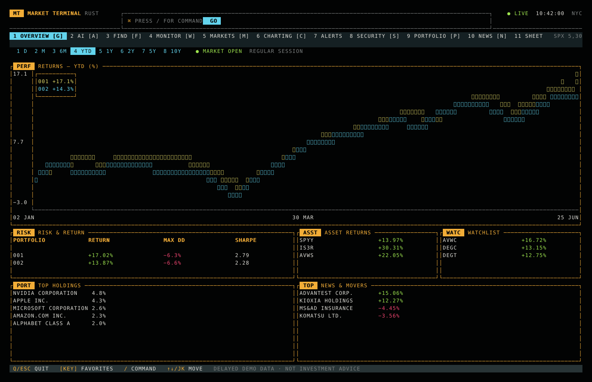
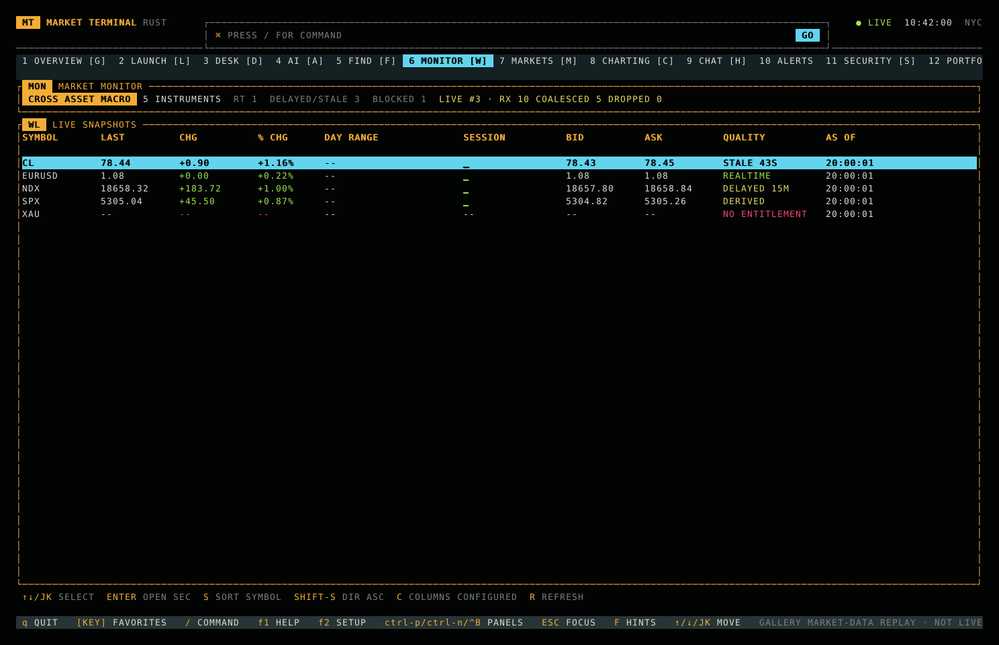
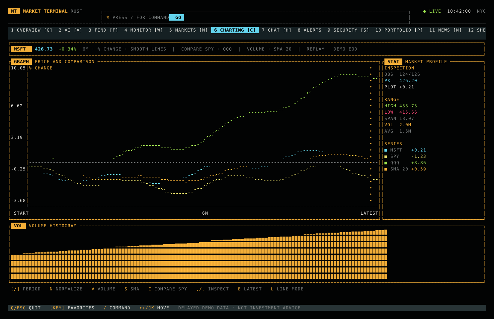
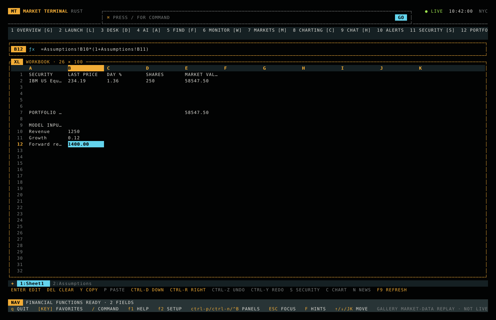
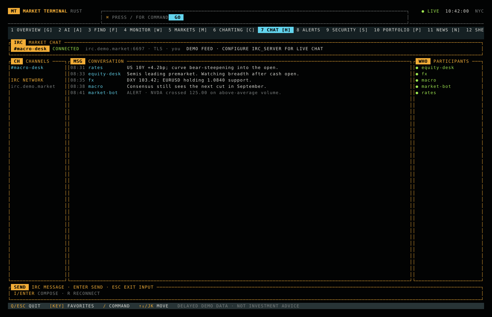
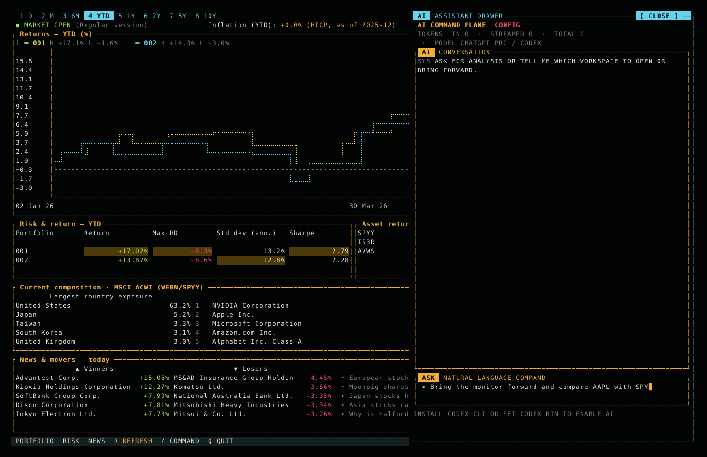
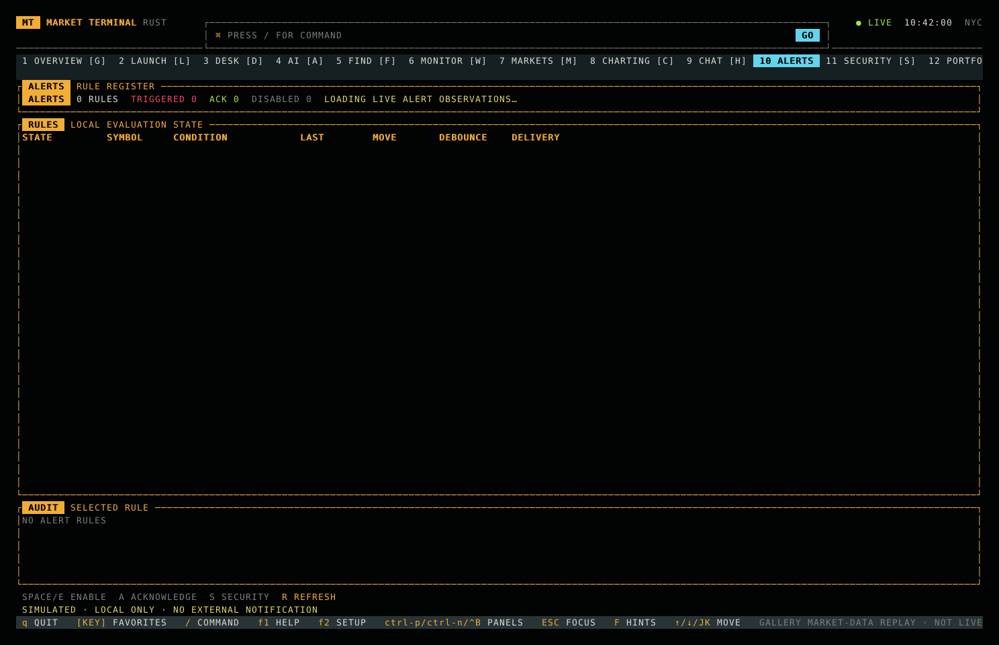
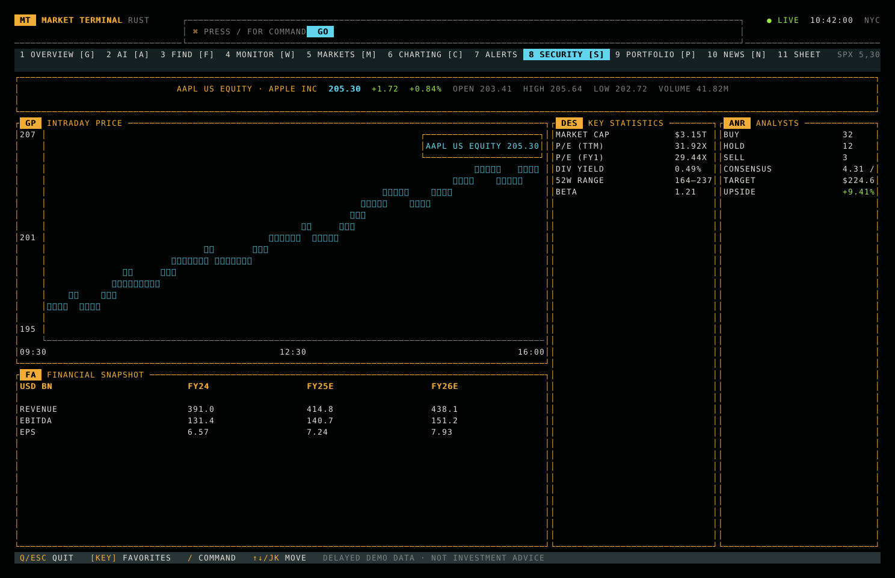
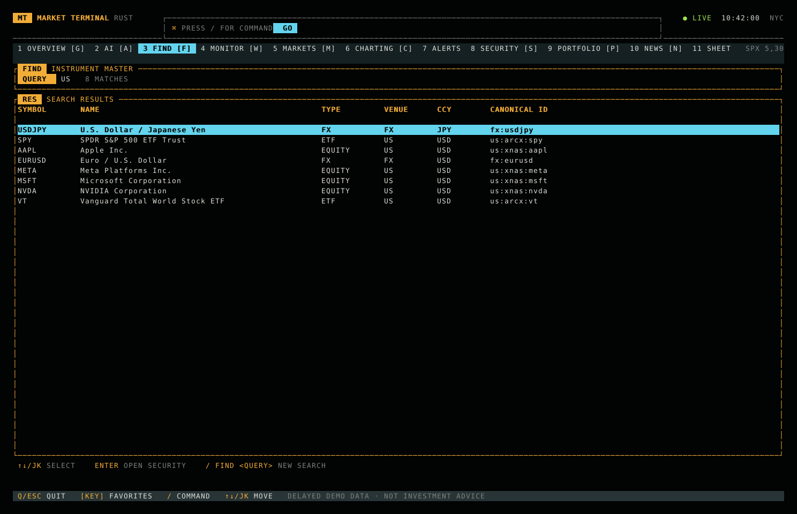

# Market Terminal

A native Rust, open-source market workstation inspired by the information
density and keyboard ergonomics of professional financial terminals.

The application runs directly in your terminal. Ratatui draws every panel,
table, chart, border, and color; Crossterm handles input and terminal state.
There is no HTML, CSS, JavaScript, WebAssembly, or browser runtime.

## Workspaces

- Overview — returns, risk, holdings, watchlist, and movers
- Markets — global indices, cross-asset monitor, sectors, breadth, and rates
- Security — quote/chart, financials, estimates, ownership, filings, peers,
  and linked news
- Portfolio — positions, allocation, attribution, scenarios, and activity
- News — filters, unread/bookmarks, story detail, linked securities, and an
  economic-event calendar
- Spreadsheet — incremental recalculation, ranges, lookups, conditional/text
  formulas, undo/redo, CSV, and market refresh
- AI — OpenRouter-backed analysis and natural-language workspace control
- Find — canonical instrument identity and ranked symbol/company discovery
- Monitor — configurable watchlists, bounded quote streams, sorting,
  data-quality states, last-known-good fallback, and replay
- Chart — comparative performance, zero baselines, inspection cursor, market
  profile statistics, volume histograms, and moving averages
- Chat — TLS-capable IRC market rooms with bounded queues, background reconnect,
  participant presence, notices, actions, and an inline composer
- Alerts — idempotent, debounced local rules with acknowledgement and audit state

Use the labeled navigation keys, or type a function such as `MON`, `CHART`,
`SHEET`, `CHAT`, `FIND`, or `ASK` into the command bar. All displayed market values are
deterministic demo data.

The interactive binary restores the active workspace, workspace order, and
recent commands from crash-safe, versioned local state. Set
`MARKET_TERMINAL_STATE_DIR` to override the platform default. Corrupt current
state falls back to the previous valid generation and never blocks startup.

## Experience gallery

These captures are generated from the native Ratatui render buffer at a
consistent 160 × 48 terminal size. They are application output, not design
mockups.

| Research overview | Live-style market monitor |
| --- | --- |
|  |  |
| **Comparative charting** | **Spreadsheet workspace** |
|  |  |
| **IRC market chat** | **OpenRouter AI command plane** |
|  |  |
| **Alerts register** | **Security research** |
|  |  |
| **Instrument discovery** | |
|  | |

## Run locally

Install Rust, then:

```bash
cargo run --release
```

Run unit tests:

```bash
cargo test
```

Create a release binary:

```bash
cargo build --release
```

## OpenRouter AI

The `AI`/`ASK` workspace runs inference on a background thread so slow provider
requests never block terminal input or rendering. Configure it with environment
variables before launching:

```bash
export OPENROUTER_API_KEY="your-key"
export OPENROUTER_MODEL="openrouter/auto" # optional; this is the default
cargo run --release
```

Press `A`, type a question, and press Enter. You can also issue a direct command
such as `AI bring portfolio forward and open it`. The model can request only
four validated UI operations: focus a registered workspace, bring a registered
workspace to the front, dispatch an existing terminal command, or restore the
default workspace order. It cannot execute shell commands, read credentials,
submit trades, or mutate arbitrary application state.

## IRC chat

The `CHAT`/`IRC` workspace connects on a dedicated Tokio worker, keeping DNS,
TLS, registration, stream reads, and reconnect delays off the render loop.
Incoming and outgoing queues are bounded so a busy room cannot grow terminal
memory without limit. Configure a server before launching:

```bash
export IRC_SERVER="irc.libera.chat"
export IRC_PORT="6697"                 # optional; inferred from IRC_TLS
export IRC_TLS="true"                  # true by default
export IRC_NICKNAME="market-terminal"
export IRC_CHANNEL="#market-terminal"
cargo run --release
```

Optional `IRC_SERVER_PASSWORD` and `IRC_NICKSERV_PASSWORD` values are passed
only to the IRC adapter and are never rendered. Press `H` or type `CHAT`, then
press `I`/Enter to compose, Enter to send, Esc to leave input, or `R` to
reconnect.

## Design constraints

- crisp type and chart strokes; no simulated CRT glow
- keyboard-first navigation
- no proprietary Bloomberg code, assets, trademarks, or data
- native Rust architecture with no browser assets

## Architecture

The codebase follows domain-driven, package-by-feature boundaries. Each
workspace owns its domain model, query port, local interaction state, and
terminal adapter. The application kernel knows only the `Workspace` contract
and registry; infrastructure implements feature-owned ports and is wired at
the composition root.

```text
src/
├── app/             lifecycle, input modes, workspace contract and registry
├── features/        bounded contexts packaged by feature
│   ├── overview/    domain + port + workspace
│   ├── markets/     domain + port + workspace
│   ├── security/    domain + port + workspace
│   ├── portfolio/   domain + port + workspace
│   ├── news/        domain + port + workspace
│   ├── instrument/  search port + discovery workspace
│   ├── market_data/ typed quote/history read contracts
│   ├── persistence/ versioned session + opaque feature-document ports
│   ├── watchlist/   monitor model + catalog port + workspace
│   ├── charting/    chart specification + history port + workspace
│   ├── chat/        IRC domain + gateway port + workspace
│   ├── spreadsheet/ workbook domain + application + presentation
│   └── assistant/   AI conversation domain + provider port + workspace
├── foundation/      narrowly shared value objects such as InstrumentId
├── infrastructure/ adapters implementing feature-owned ports
├── ui/              theme, terminal chrome, and reusable visual primitives
└── bootstrap.rs     dependency injection and feature registration
```

See [`docs/architecture.md`](docs/architecture.md) for dependency rules and
the recipe for adding a new terminal function.

## License

MIT © 2026 DJ Petersen.
